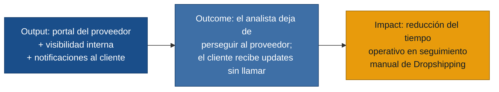

# MVP Canvas — Portal Dropshipping

## Cadena de valor

---

| Bloque | Contenido |
|---|---|
| **Propuesta de valor** | Dar trazabilidad estructurada al ciclo Dropshipping — desde que el proveedor acepta la orden hasta la entrega con evidencia — eliminando el seguimiento manual del analista y las consultas del cliente por desconocimiento. |
| **Segmento de usuarios** | Proveedor (actor externo crítico, necesita el portal para operar), Analista de Compras y Logística (necesita visibilidad sin perseguir al proveedor), Especialista de eCommerce (necesita reducir consultas entrantes sin intervenir en cada pedido), Cliente (necesita notificaciones automáticas en hitos clave). |
| **Funcionalidades mínimas** | 1. **Portal del proveedor**: ver órdenes asignadas con información completa, aceptar/rechazar con fecha estimada, registrar guía o información de transporte alternativa, marcar entregado con evidencia adjunta, registrar novedades desde el campo. 2. **Vista del analista**: estado en tiempo real de todos los pedidos Dropshipping activos, alerta cuando un pedido no tiene update en el plazo configurado, historial inmutable de cambios. 3. **Notificaciones automáticas al cliente**: proveedor aceptó (con fecha estimada), pedido despachado (con tracking si existe), entregado, cambio de fecha (con fecha anterior y nueva). |
| **Resultado esperado (outcome)** | El analista deja de enviar correos o hacer llamadas para saber si el proveedor aceptó o despachó. El cliente no tiene que llamar para preguntar el estado de su pedido Dropshipping. El proveedor usa el portal como canal principal para los cuatro hitos (aceptar, despachar, entregar, novedad) en lugar del correo. |
| **Métrica de éxito** | **% de pedidos Dropshipping en los que el analista no realizó ninguna consulta activa (correo o llamada) al proveedor durante el ciclo completo del pedido.** Meta: ≥ 70 % en las primeras 8 semanas de operación con el portal activo. — _Prueba ácida_: si este número sube al 80 %, el equipo de operaciones puede decidir reasignar el tiempo dedicado a seguimiento manual; si no sube, significa que el portal no está siendo usado por los proveedores y hay que investigar por qué. |
| **Riesgos / supuestos** | 1. **Adopción del proveedor**: se asume que el portal será lo suficientemente simple para que los proveedores no vuelvan al correo. El proveedor entrevistado advirtió explícitamente que si tiene demasiados campos, abandona el portal. Sin adopción del proveedor, el MVP no entrega valor. 2. **Información completa en la orden**: se asume que la orden llegará al proveedor con todos los datos necesarios (dirección, contacto, condiciones especiales) desde la primera versión. Si no, el proveedor seguirá necesitando consultar antes de aceptar. 3. **Cobertura de notificaciones**: se asume que los 4 hitos de notificación (aceptado / despachado / entregado / cambio de fecha) cubren la mayoría de las consultas entrantes. Si los clientes siguen llamando por otros motivos, el MVP no reducirá el volumen de atención. 4. **Disposición del analista a cambiar herramienta**: hoy trabaja con correos y sistema propio. El portal debe ofrecer más valor que ese flujo para ser adoptado. |
| **Fuera de alcance (por ahora)** | **Flujo Pickup completo** (alertas de tienda, vencimiento de reserva, registro de retiro): opera con actores y flujo diferentes; se aborda en el siguiente ciclo. **Checkout diferenciado por modalidad**: requiere cambios en la capa del eCommerce; es un proyecto paralelo con el equipo de frontend. **Pedidos con múltiples proveedores**: añade complejidad de coordinación; se pospone a v2 cuando el flujo de un proveedor esté estabilizado. **Reconciliación contable**: proceso financiero separado que depende de definiciones previas de cuentas transitorias. **Comparativa y scoring de proveedores**: requiere historial mínimo de 2-3 meses; posible en v2. **Evidencia fotográfica de estado al despachar** (antes de entrega): útil para disputas de daño, pero no bloquea el valor central del MVP; se añade en v2. **Canal único de atención al cliente**: requiere integración de CRM; escala de plataforma diferente. |

---

## Notas de implementación

### Simplicidad del portal del proveedor (riesgo #1)
El proveedor entrevistado dijo explícitamente: _"si para cada pedido tengo que llenar demasiados campos, al final la gente vuelve al correo"_ _(entrevista_proveedor.md)_. El portal debe permitir completar cada hito en ≤ 3 acciones. Validar con al menos un proveedor piloto antes de lanzar a todos.

### Proceso alternativo por correo (no funcional R-24)
No todos los proveedores adoptarán el portal desde el primer día. Debe existir un mecanismo para que el analista registre manualmente actualizaciones de proveedores que operen por correo, manteniendo la trazabilidad en el mismo historial. Esto protege la métrica de éxito: el problema no es "el proveedor usó el portal" sino "el analista no tuvo que perseguir la información".

### Reserva de inventario al confirmar pedido (riesgo #2 — stock doble canal)
El proveedor señaló que el inventario compartido puede venderse en otro canal antes de actualizar el portal. En cuanto se confirme el pedido, el sistema debe reservar la unidad y mostrar la hora de la última actualización de disponibilidad.
