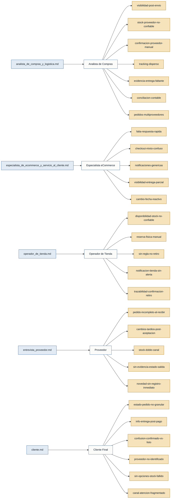

# Personas y Stakeholders — Dropshipping

## Personas

### Analista de Compras y Logística — analista de compras y logística
- **Contexto:** Gestiona la relación con proveedores y el ciclo de vida de los pedidos Dropshipping desde la orden hasta la entrega.
- **Objetivo principal:** Tener visibilidad y control del pedido después de enviarlo al proveedor, sin depender de consultas manuales.
- **Dolores:**
  - `visibilidad-post-envio`: No sabe si el proveedor vio, aceptó o despachó el pedido hasta que el cliente reclama. _(analista_de_compras_y_logistica.md)_
  - `stock-proveedor-no-confiable`: El inventario del proveedor no siempre está actualizado; se puede vender un producto sin stock real. La fecha de última actualización es desconocida. _(analista_de_compras_y_logistica.md)_
  - `confirmacion-proveedor-manual`: No existe un mecanismo estructurado para que el proveedor acepte o rechace el pedido con fecha estimada. _(analista_de_compras_y_logistica.md)_
  - `tracking-disperso`: El número de tracking se copia manualmente en notas sueltas; el cliente no lo recibe automáticamente. _(analista_de_compras_y_logistica.md)_
  - `evidencia-entrega-faltante`: El proveedor puede declarar que entregó sin evidencia verificable; las novedades no se gestionan como incidencias. _(analista_de_compras_y_logistica.md)_
  - `conciliacion-contable`: La factura del proveedor llega tarde o con diferencias; los costos de transporte no siempre se asignan correctamente. _(analista_de_compras_y_logistica.md)_
  - `pedidos-multiproveedores`: En pedidos con varios proveedores, el seguimiento línea a línea no existe; el pedido queda bloqueado hasta que todos despachen. _(analista_de_compras_y_logistica.md)_
- **Respaldo:** `primera mano` _(analista_de_compras_y_logistica.md)_

---

### Especialista de eCommerce y Servicio al Cliente — especialista de ecommerce y servicio al cliente
- **Contexto:** Gestiona la experiencia de compra en el canal digital y atiende reclamos y consultas de clientes post-venta.
- **Objetivo principal:** Que el cliente entienda desde el inicio cómo recibirá cada producto y pueda consultar el avance sin necesidad de llamar.
- **Dolores:**
  - `falta-respuesta-rapida`: Para responder "¿dónde está mi pedido?" hay que consultar tienda, logística o al proveedor; el cliente siente que nadie sabe nada. _(especialista_de_ecommerce_y_servicio_al_cliente.md)_
  - `checkout-mixto-confuso`: El checkout no distingue por producto la modalidad de entrega (Pickup / Delivery / Dropshipping), generando expectativas falsas antes del pago. _(especialista_de_ecommerce_y_servicio_al_cliente.md)_
  - `notificaciones-genericas`: Las notificaciones no indican a qué producto corresponde el cambio ni detallan qué fue lo que cambió. _(especialista_de_ecommerce_y_servicio_al_cliente.md)_
  - `visibilidad-entrega-parcial`: El estado general del pedido no refleja qué ya se entregó y qué falta; el cliente llama cuando recibe solo una parte. _(especialista_de_ecommerce_y_servicio_al_cliente.md)_
  - `cambio-fecha-reactivo`: El cliente se entera del cambio de fecha porque pregunta, no porque el sistema lo notifique proactivamente. _(especialista_de_ecommerce_y_servicio_al_cliente.md)_
- **Respaldo:** `primera mano` _(especialista_de_ecommerce_y_servicio_al_cliente.md)_

---

### Operador de Tienda — operador de tienda
- **Contexto:** Atiende los pedidos Pickup en sucursal: verifica stock, separa el producto, notifica al cliente y registra el retiro.
- **Objetivo principal:** Recibir tareas claras dentro del sistema, confirmar disponibilidad real del producto y cerrar el proceso con trazabilidad.
- **Dolores:**
  - `disponibilidad-stock-no-confiable`: El sistema muestra stock pero no indica si está libre, comprometido, en exhibición o con novedad; obliga a confirmar físicamente en bodega. _(operador_de_tienda.md)_
  - `reserva-fisica-manual`: La separación del producto es manual (notas, impresiones); puede moverse o perderse antes de que el cliente llegue. _(operador_de_tienda.md)_
  - `sin-regla-no-retiro`: No existe una regla uniforme para gestionar el no-retiro; la reserva puede quedar bloqueada indefinidamente. _(operador_de_tienda.md)_
  - `notificacion-tienda-sin-alerta`: Los pedidos Pickup se notifican por correo o mensaje; no hay alerta dentro del sistema y la notificación se puede perder. _(operador_de_tienda.md)_
  - `trazabilidad-confirmacion-retiro`: El registro de que el cliente retiró se hace en papel; no hay trazabilidad digital de quién entregó, quién recibió ni cuándo. _(operador_de_tienda.md)_
- **Respaldo:** `primera mano` _(operador_de_tienda.md)_

---

### Proveedor — proveedor
- **Contexto:** Tercero externo que recibe la orden Dropshipping, la acepta o rechaza, prepara el despacho y entrega directamente al cliente final.
- **Objetivo principal:** Recibir las órdenes con información completa a través de un canal único y poder actualizar el estado del pedido sin depender del correo.
- **Dolores:**
  - `pedido-incompleto-al-recibir`: Las órdenes llegan sin toda la información necesaria (dirección, teléfono, condiciones especiales); hay que preguntar antes de procesar. _(entrevista_proveedor.md)_
  - `cambios-tardios-post-aceptacion`: Los cambios de dirección, fecha o cancelaciones llegan después de haber preparado el despacho, generando costos de transporte o devolución sin responsable claro. _(entrevista_proveedor.md)_
  - `stock-doble-canal`: El inventario compartido puede venderse en otro canal antes de actualizar el portal, causando doble venta de la misma unidad. _(entrevista_proveedor.md)_
  - `sin-evidencia-estado-salida`: No existe registro fotográfico del estado del producto al momento de despachar; cuando llega dañado no hay forma de determinar responsabilidades. _(entrevista_proveedor.md)_
  - `novedad-sin-registro-inmediato`: Cuando el cliente no está disponible, el conductor reporta internamente pero la información tarda en llegar a todos los actores; no puede registrar la novedad en el momento. _(entrevista_proveedor.md)_
- **Respaldo:** `primera mano` _(entrevista_proveedor.md)_

---

### Cliente Final — cliente
- **Contexto:** Comprador que adquiere productos en el eCommerce con modalidades de entrega mixtas (Pickup, Delivery, Dropshipping).
- **Objetivo principal:** Entender desde el inicio cómo y cuándo recibirá cada producto, y poder hacer seguimiento sin tener que llamar.
- **Dolores:**
  - `estado-pedido-no-granular`: El estado general "en proceso" no distingue qué producto está listo y cuál sigue pendiente; tuvo que llamar para preguntar y no recibió respuesta inmediata. _(cliente.md)_
  - `info-entrega-post-pago`: Solo descubrió cómo recibiría cada producto al recibir mensajes separados tras pagar; quería saberlo antes de confirmar la compra. _(cliente.md)_
  - `confusion-confirmado-vs-listo`: Interpretó "pedido confirmado" como "listo para retirar" y fue a la tienda antes de recibir el aviso de preparación. _(cliente.md)_
  - `proveedor-no-identificado`: El proveedor llamó para coordinar la entrega sin previo aviso; pensó que era una llamada no deseada. _(cliente.md)_
  - `sin-opciones-stock-fallido`: Cuando el stock prometido no estaba disponible, no recibió alternativas inmediatas (cambiar tienda, recibir a domicilio, cancelar esa línea). _(cliente.md)_
  - `canal-atencion-fragmentado`: Al buscar ayuda fue trasladado de un área a otra; espera un único canal de contacto aunque internamente participen varios equipos. _(cliente.md)_
- **Respaldo:** `primera mano` _(cliente.md)_

---

## Stakeholders

### Equipo Comercial
- **Interés en el sistema:** Recibir alerta inmediata cuando un proveedor rechaza un pedido, para poder ofrecer una alternativa al cliente antes de que este reclame.
- **Fuente:** _analista_de_compras_y_logistica.md_

### Jefe de Tienda
- **Interés en el sistema:** Recibir escalaciones automáticas cuando el operador de tienda no atiende un pedido Pickup dentro del tiempo definido.
- **Fuente:** _operador_de_tienda.md_

---

## Mapa de trazabilidad

