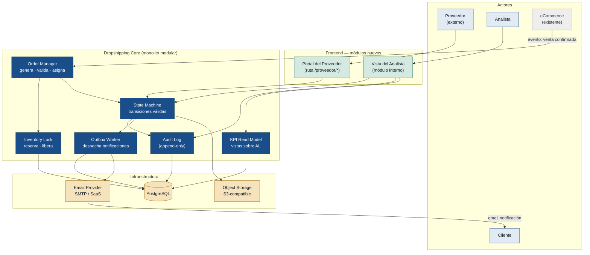

# Arquitectura — Portal Dropshipping

## Contexto

El MVP entrega trazabilidad estructurada al ciclo Dropshipping: un portal para que el proveedor opere los cuatro hitos de entrega (aceptar, despachar, entregar, novedad), una vista interna para el analista, notificaciones automáticas al cliente en email y un dashboard de KPIs operativos. La métrica guía es **≥ 70 % de pedidos cerrados sin consulta manual del analista** en las primeras 8 semanas.

Son 17 historias, 55 puntos. El equipo es pequeño y el producto está en descubrimiento temprano: la arquitectura debe ser la más simple que sostenga el valor, sin compromisos prematuros.

---

## Principio guía

> **Lo más simple que funcione.** Cada decisión que aplazamos es una decisión que no cometemos en el momento equivocado.  
> Las `open_questions` de arquitectura no son omisiones: son trabajo no hecho intencionalmente.

---

## Diagrama de componentes

---

## Módulos

### 1. Order Manager (E1)
Recibe el evento de venta confirmada desde eCommerce. Valida que la orden tenga todos los campos requeridos (US-03 / R-32), identifica al proveedor asignado al producto (US-01 / R-01) y reserva la unidad de inventario integrado (US-02 / R-33). Si alguna validación falla, alerta al analista sin crear la orden.

### 2. State Machine (E2 · E3)
Define los estados válidos del pedido y sus transiciones. Bloquea mutaciones ilegales (ej. `EN_TRANSITO → ENTREGADO` sin evidencia adjunta). Toda operación del portal del proveedor y del analista pasa por aquí; nada escribe directamente a la tabla de pedidos.

**Estados:** `PENDIENTE_ACEPTACION → ACEPTADO → EN_TRANSITO → ENTREGADO / NOVEDAD / CANCELADO / RECHAZADO`

### 3. Audit Log (E3 — US-11)
Tabla `order_history` de solo inserción: INSERT permitido, UPDATE y DELETE prohibidos por constraint de base de datos. Registra actor, estado anterior, estado nuevo y timestamp en cada transición. El estado actual del pedido se desnormaliza en la tabla `orders` para lectura rápida; siempre es consistente con el último registro del Audit Log gracias a la State Machine.

### 4. Inventory Lock (E1 — US-02)
Reserva la unidad del proveedor en el momento de confirmar el pedido. La libera si el proveedor rechaza o si el pedido es cancelado. Opera en la misma transacción que la creación de la orden (ACID garantizado dentro del monolito).

### 5. Outbox Worker (E4 — US-13, 14, 15)
En el mismo commit que cada transición de estado, la State Machine inserta un registro en `outbox_messages`. Un proceso worker independiente lee los mensajes pendientes, envía el email al cliente vía el proveedor configurado (SMTP o SaaS) y marca el registro como enviado. Garantiza "al menos una entrega" sin bloquear el request del proveedor.

### 6. Portal del Proveedor (E2)
Módulo web en el frontend existente, bajo la ruta `/proveedor/*`, con contexto de autenticación separado (magic link). Accede únicamente a las órdenes propias del proveedor autenticado. No expone datos internos más allá de lo necesario para operar los hitos (R-23).

### 7. Vista del Analista (E3)
Módulo interno del sistema operativo. Carga la lista de pedidos activos con polling corto (30 s) o WebSocket si ya disponible en el frontend. Incluye el formulario de registro manual con etiqueta "registro manual" obligatoria (US-12).

### 8. KPI Read Model (E5)
Vistas SQL materializadas sobre el Audit Log y la tabla de pedidos. Se recalculan en background cada N minutos (configurable). Latencia aceptada: datos con hasta 5 minutos de retraso en MVP. No bloquea la operación principal.

---

## Decisiones de arquitectura

| ADR | Decisión | Épica/Historia motivadora |
|-----|----------|--------------------------|
| [ADR-0001](adr/ADR-0001-monolito-modular.md) | Monolito modular, no microservicios | E1–E5 (MVP de 17 historias) |
| [ADR-0002](adr/ADR-0002-audit-log-append-only.md) | Audit Log append-only, no event sourcing | US-11, R-05 |
| [ADR-0003](adr/ADR-0003-portal-proveedor-modulo-frontend.md) | Portal del proveedor como módulo del frontend existente | US-04, R-30 |
| [ADR-0004](adr/ADR-0004-autenticacion-magic-link.md) | Autenticación del proveedor por magic link | R-30, R-23 |
| [ADR-0005](adr/ADR-0005-notificaciones-outbox-transaccional.md) | Notificaciones por patrón outbox transaccional | US-13, US-14, US-15 |
| [ADR-0006](adr/ADR-0006-maquina-de-estados-explicita.md) | Estado del pedido como máquina de estados explícita | US-07, US-08, R-08 |
| [ADR-0007](adr/ADR-0007-evidencias-object-storage.md) | Evidencias en object storage S3-compatible | US-07, US-08 |

---

## Lo que NO se decide todavía

Estas son decisiones aplazadas intencionalmente. No son omisiones.

| # | Decisión pendiente | Por qué se aplaza | Impacto si se necesita |
|---|-------------------|-------------------|------------------------|
| OA-1 | Canal de notificaciones alternativo (SMS, WhatsApp) | No hay evidencia de necesidad en el discovery. Email cubre MVP. | Añadir un nuevo tipo de `outbox_message` sin cambiar la state machine. |
| OA-2 | Integración API/ERP del proveedor | OQ-2: ningún proveedor del MVP requiere integración ERP confirmada. | Proyecto separado post-MVP; el portal web queda como canal paralelo. |
| OA-3 | WebSocket vs. polling para la vista del analista | Depende del framework de frontend elegido. 30 s de latencia es aceptable para MVP. | Reemplazar el polling por WebSocket sin cambiar la API del backend. |
| OA-4 | Multi-tenancy del portal del proveedor | MVP tiene proveedores que operan con uno o pocos productos. Complejidad de tenant-isolation no está justificada. | Añadir `tenant_id` como columna cuando el volumen lo exija. |
| OA-5 | CQRS con read model dedicado para KPIs en tiempo real | Las vistas SQL materializadas son suficientes en MVP. | Migrar el KPI Read Model a un proceso CQRS si el volumen de datos excede la capacidad de las vistas. |
| OA-6 | Política de lifecycle del object storage | Evidencias del MVP se retienen indefinidamente. La política legal de retención/eliminación no está definida. | Configurar reglas de lifecycle en el bucket sin cambiar el código. |
