# Épicas — Portal Dropshipping

## Resumen ejecutivo

El MVP entrega trazabilidad estructurada al ciclo Dropshipping —desde que el proveedor acepta la orden hasta la entrega con evidencia— eliminando el seguimiento manual del analista y las consultas del cliente por desconocimiento. El impacto esperado es que ≥ 70 % de los pedidos Dropshipping cierren sin que el analista haya realizado ninguna consulta activa al proveedor. Todo lo que no sea el núcleo de este flujo (Pickup, checkout diferenciado, múltiples proveedores, reconciliación contable) está explícitamente fuera de alcance del MVP.

---

## Épicas priorizadas

### E1 · Generación y Asignación de Órdenes Dropshipping
**Prioridad:** Alta  
**Valor:** Prerequisito de todo el flujo: el proveedor recibe la orden con información completa desde el primer momento, eliminando las consultas previas a la aceptación y la doble venta por inventario no reservado.  
**Origin:** `mvp-canvas.md` — *"se asume que la orden llegará al proveedor con todos los datos necesarios (dirección, contacto, condiciones especiales) desde la primera versión"* · `requisitos.md` R-01 ("Al confirmar una venta Dropshipping, el sistema debe identificar automáticamente al proveedor y generar la solicitud/orden de compra") · R-32 ("La orden enviada al proveedor debe incluir todos los datos necesarios: código del producto, descripción, cantidad, dirección completa, ciudad, contacto del cliente, fecha esperada y condiciones especiales") · R-33 ("El sistema debe bloquear la unidad de inventario del proveedor en el momento en que se confirma el pedido")  
**Historias candidatas:**
- HC-1.1: Generación automática de orden al proveedor al confirmar venta Dropshipping
- HC-1.2: Reserva de inventario del proveedor al confirmar el pedido
- HC-1.3: Validación de completitud de la orden antes de enviarla al proveedor

---

### E2 · Portal del Proveedor — Gestión de Hitos de Entrega
**Prioridad:** Alta  
**Valor:** El proveedor opera desde un canal único para los cuatro hitos críticos (aceptar/rechazar, despachar, entregar con evidencia, registrar novedad), eliminando el correo como medio de comunicación. Sin adopción del proveedor el MVP no entrega ningún valor.  
**Origin:** `mvp-canvas.md` — *"Portal del proveedor: ver órdenes asignadas con información completa, aceptar/rechazar con fecha estimada, registrar guía o información de transporte alternativa, marcar entregado con evidencia adjunta, registrar novedades desde el campo"* · `mvp-canvas.md` — *"El portal debe permitir completar cada hito en ≤ 3 acciones. Validar con al menos un proveedor piloto antes de lanzar a todos"* · `personas.md` Proveedor: `pedido-incompleto-al-recibir`, `novedad-sin-registro-inmediato` · `user-stories.md` US-01, US-02, US-03, US-04 · `requisitos.md` R-02, R-03, R-06, R-07, R-08, R-30, R-34  
**Historias candidatas:**
- HC-2.1: Ver órdenes asignadas con información completa y aceptarlas con fecha estimada de despacho
- HC-2.2: Rechazar una orden indicando el motivo (alerta al equipo comercial)
- HC-2.3: Registrar despacho con guía de transporte o información de transporte alternativo
- HC-2.4: Confirmar entrega con evidencia adjunta (firma, foto o nombre del receptor)
- HC-2.5: Registrar novedad de entrega desde el campo con tipo, observación y foto opcional

---

### E3 · Visibilidad y Trazabilidad Interna para el Analista
**Prioridad:** Alta  
**Valor:** El analista ve el estado real de todos los pedidos Dropshipping activos en una sola vista y accede al historial inmutable de cada pedido, dejando de enviar correos y llamadas para saber si el proveedor aceptó o despachó. Es el outcome central del MVP.  
**Origin:** `mvp-canvas.md` — *"Vista del analista: estado en tiempo real de todos los pedidos Dropshipping activos, alerta cuando un pedido no tiene update en el plazo configurado, historial inmutable de cambios"* · `personas.md` Analista: `visibilidad-post-envio`, `confirmacion-proveedor-manual`, `tracking-disperso`, `evidencia-entrega-faltante` · `user-stories.md` US-05, US-06 · `requisitos.md` R-05, R-21, R-24  
**Historias candidatas:**
- HC-3.1: Vista en tiempo real de todos los pedidos Dropshipping activos con estado, proveedor y días sin update
- HC-3.2: Alerta automática al analista cuando un pedido supera el plazo configurado sin actualización del proveedor
- HC-3.3: Historial inmutable de cambios de estado de cada pedido (actor + timestamp)
- HC-3.4: Registro manual de actualizaciones para proveedores que operan por correo (proceso alternativo trazable)

---

### E4 · Notificaciones Automáticas al Cliente en Hitos Clave
**Prioridad:** Alta  
**Valor:** El cliente recibe información proactiva en los cuatro hitos del pedido (aceptado, despachado, entregado, cambio de fecha) y sabe cuándo esperar contacto del proveedor, reduciendo las consultas entrantes al especialista de eCommerce.  
**Origin:** `mvp-canvas.md` — *"Notificaciones automáticas al cliente: proveedor aceptó (con fecha estimada), pedido despachado (con tracking si existe), entregado, cambio de fecha (con fecha anterior y nueva)"* · `personas.md` Especialista eCommerce: `notificaciones-genericas`, `cambio-fecha-reactivo` · Cliente: `proveedor-no-identificado` · `user-stories.md` US-07, US-08, US-09 · `requisitos.md` R-13, R-14, R-29  
**Historias candidatas:**
- HC-4.1: Notificación automática al cliente en cada hito del pedido Dropshipping (aceptado, despachado, entregado) con nombre del producto y detalle específico
- HC-4.2: Notificación proactiva al cliente cuando cambia la fecha de entrega (fecha anterior → nueva)
- HC-4.3: Preaviso al cliente antes de que el proveedor lo contacte para coordinar entrega

---

### E5 · Indicadores Operativos del Proceso Dropshipping
**Prioridad:** Media  
**Valor:** Expone los KPIs que permiten medir si el MVP está funcionando (cumplimiento de fechas, pedidos sin consulta manual, novedades, tiempo de aceptación) y distingue retrasos imputables al proveedor de los causados internamente.  
**Origin:** `mvp-canvas.md` — *"Métrica de éxito: % de pedidos Dropshipping en los que el analista no realizó ninguna consulta activa al proveedor durante el ciclo completo"* · `requisitos.md` R-21 ("tiempo de aceptación del proveedor, cumplimiento de fecha prometida, pedidos rechazados por falta de stock, entregas con novedad y tiempo total hasta entrega") · R-36 ("tasa de pedidos recibidos con información incompleta y tasa de pedidos que cambiaron después de ser aceptados")  
**Historias candidatas:**
- HC-5.1: Dashboard de KPIs operativos Dropshipping para el analista (tiempo de aceptación, cumplimiento de fechas, novedades)
- HC-5.2: Indicadores diferenciados del proveedor: tasa de órdenes con información incompleta vs. cambios post-aceptación

---

## Diagrama Mermaid del backlog

```mermaid
graph TD
    E1[E1 · Generación y Asignación de Órdenes\nALTA]
    E2[E2 · Portal del Proveedor — Hitos de Entrega\nALTA]
    E3[E3 · Visibilidad Interna para el Analista\nALTA]
    E4[E4 · Notificaciones Automáticas al Cliente\nALTA]
    E5[E5 · Indicadores Operativos\nMEDIA]

    E1 --> HC11[HC-1.1 Generación automática de orden]
    E1 --> HC12[HC-1.2 Reserva de inventario al confirmar]
    E1 --> HC13[HC-1.3 Validación de completitud de orden]

    E2 --> HC21[HC-2.1 Ver y aceptar órdenes con fecha estimada]
    E2 --> HC22[HC-2.2 Rechazar orden con motivo]
    E2 --> HC23[HC-2.3 Registrar despacho con tracking/transporte]
    E2 --> HC24[HC-2.4 Confirmar entrega con evidencia]
    E2 --> HC25[HC-2.5 Registrar novedad de entrega desde campo]

    E3 --> HC31[HC-3.1 Vista en tiempo real de pedidos activos]
    E3 --> HC32[HC-3.2 Alerta por pedido sin update en plazo]
    E3 --> HC33[HC-3.3 Historial inmutable actor + timestamp]
    E3 --> HC34[HC-3.4 Registro manual proceso alternativo correo]

    E4 --> HC41[HC-4.1 Notificación en hitos clave al cliente]
    E4 --> HC42[HC-4.2 Notificación proactiva cambio de fecha]
    E4 --> HC43[HC-4.3 Preaviso contacto proveedor]

    E5 --> HC51[HC-5.1 Dashboard KPIs operativos Dropshipping]
    E5 --> HC52[HC-5.2 Indicadores diferenciados del proveedor]
```

---

## Supuestos abiertos (open_questions)

- **OQ-1:** ¿A través de qué canal se envían las notificaciones al cliente (email, SMS, push, WhatsApp)? El discovery menciona notificaciones pero no especifica el canal ni si ya existe infraestructura para ello.
- **OQ-2:** ¿El portal del proveedor es una URL pública (web) o requiere integración con su propio sistema? El discovery asume que el proveedor accederá por web, pero no se validó si algún proveedor tiene ERP propio.
- **OQ-3:** ¿Cuál es el plazo configurado para la alerta del analista por pedido sin update? El discovery menciona "plazo configurado" pero no define el valor por defecto ni quién lo configura.
- **OQ-4:** El proceso alternativo por correo (R-24) requiere que el analista registre manualmente. ¿Existe ya un flujo de aprobación o es registro libre? Esto impacta la integridad del historial inmutable.
- **OQ-5:** ¿La reserva de inventario (R-33) aplica también a proveedores que gestionan su stock fuera del sistema? El discovery asume inventario integrado pero el dolor `stock-doble-canal` sugiere que no siempre lo está.
