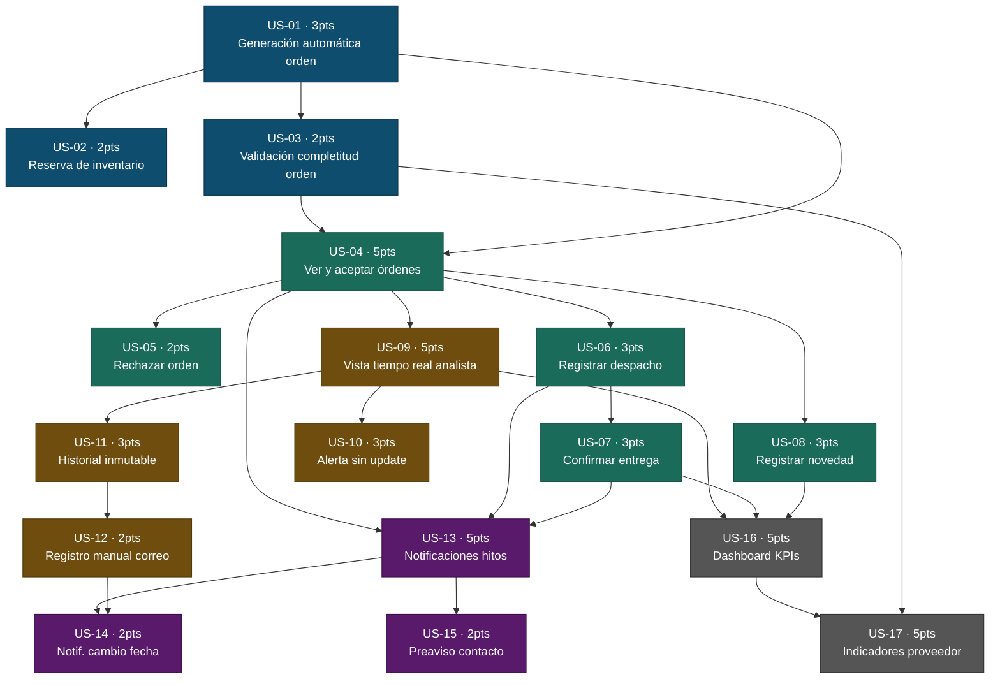

# Historias refinadas — Portal Dropshipping

> **17 historias · 55 puntos totales**  
> Todas cumplen INVEST + Definition of Ready.  
> Supuestos abiertos resueltos: canal email (OQ-1), portal web (OQ-2), alerta 48h (OQ-3), registro manual libre (OQ-4), reserva en inventario integrado (OQ-5).

---

## Épica E1 · Generación y Asignación de Órdenes Dropshipping

### US-01 · Generación automática de orden al confirmar venta   ·   E1   ·   3 pts
**Como** Analista de Compras y Logística, **quiero** que al confirmar una venta Dropshipping el sistema genere y envíe automáticamente la solicitud de orden al proveedor asignado al producto, **para** no tener que crearla manualmente y que el proveedor la reciba de inmediato sin depender de correos.

Criterios de aceptación (Gherkin):
- Dado que se registra el pago de una venta Dropshipping, cuando el sistema procesa la confirmación, entonces identifica al proveedor del producto y genera la orden automáticamente en menos de 1 minuto.
- Dado que la orden es generada, cuando el proveedor accede al portal, entonces la ve en su lista de órdenes pendientes con todos los campos requeridos por R-32.
- Dado que el sistema no puede identificar un proveedor para el producto, cuando intenta crear la orden, entonces genera una alerta al analista y no crea una orden vacía.

Origen: `requisitos.md` R-01 · `personas.md` Analista: dolor `confirmacion-proveedor-manual`

---

### US-02 · Reserva automática de inventario al confirmar pedido   ·   E1   ·   2 pts
**Como** Analista de Compras y Logística, **quiero** que al confirmar el pedido el sistema reserve automáticamente la unidad del proveedor en el inventario del sistema, **para** evitar que la misma unidad se venda en otro canal antes de que el proveedor actualice disponibilidad.

Criterios de aceptación (Gherkin):
- Dado que se confirma un pedido Dropshipping con inventario integrado en el sistema, cuando se genera la orden, entonces la unidad queda marcada como 'reservada' y no aparece disponible para otros pedidos ni canales.
- Dado que el proveedor rechaza el pedido, cuando registra el rechazo en el portal, entonces el sistema libera la reserva automáticamente.
- Dado que el pedido es cancelado, cuando el sistema registra la cancelación, entonces libera la reserva de inventario correspondiente.
- Dado que el producto usa inventario externo al sistema, cuando se confirma el pedido, entonces el sistema notifica al analista que la reserva debe gestionarse manualmente fuera del sistema.

Origen: `requisitos.md` R-33 · `personas.md` Proveedor: dolor `stock-doble-canal` · `mvp-canvas.md` Nota: Reserva de inventario

---

### US-03 · Validación de completitud de la orden antes de enviarla   ·   E1   ·   2 pts
**Como** Proveedor, **quiero** recibir órdenes que incluyan todos los datos necesarios (código del producto, descripción, cantidad, dirección completa con ciudad, teléfono del cliente, fecha esperada y condiciones especiales), **para** poder aceptar y procesar el pedido sin tener que contactar al analista para completar información faltante.

Criterios de aceptación (Gherkin):
- Dado que el sistema genera una orden Dropshipping, cuando va a enviarla al proveedor, entonces valida que incluya: código de producto, descripción, cantidad, dirección con ciudad, teléfono del cliente, fecha esperada y condiciones especiales si aplica.
- Dado que un campo obligatorio está vacío en la orden, cuando el sistema intenta enviarla, entonces bloquea el envío y notifica al analista indicando cuál campo falta.
- Dado que la orden tiene todos los campos completos, cuando el sistema la envía al proveedor, entonces el proveedor la recibe en el portal con todos los datos visibles sin ningún campo en blanco.

Origen: `requisitos.md` R-32 · `personas.md` Proveedor: dolor `pedido-incompleto-al-recibir`

---

## Épica E2 · Portal del Proveedor — Gestión de Hitos de Entrega

### US-04 · Ver y aceptar órdenes asignadas con fecha estimada   ·   E2   ·   5 pts
**Como** Proveedor, **quiero** ver mis órdenes Dropshipping asignadas con toda la información del pedido y poder aceptarlas indicando una fecha estimada de despacho, **para** poder operar desde el portal sin necesidad de consultar correos ni contactar al analista para obtener datos.

Criterios de aceptación (Gherkin):
- Dado que el proveedor accede al portal, cuando tiene órdenes asignadas, entonces las ve en una lista con: código de producto, descripción, cantidad, dirección, teléfono del cliente, fecha esperada y condiciones especiales.
- Dado que el proveedor acepta una orden, cuando ingresa la fecha estimada de despacho y confirma, entonces el pedido cambia a estado 'Aceptado', se registran actor y timestamp, y el analista ve la actualización en su vista.
- Dado que el proveedor intenta aceptar sin ingresar una fecha estimada, cuando intenta guardar, entonces el sistema bloquea la acción e indica que la fecha estimada es requerida.
- Dado que el proveedor completa el hito de aceptación, cuando el sistema lo registra, entonces el flujo completo no requirió más de 3 acciones desde que el proveedor abrió la orden.

Origen: `user-stories.md` US-01 · `requisitos.md` R-02, R-30 · `mvp-canvas.md` Nota: "≤ 3 acciones por hito"

---

### US-05 · Rechazar una orden indicando el motivo   ·   E2   ·   2 pts
**Como** Proveedor, **quiero** poder rechazar una orden indicando el motivo del rechazo, **para** que el equipo comercial reciba una alerta inmediata y pueda ofrecer una alternativa al cliente antes de que reclame.

Criterios de aceptación (Gherkin):
- Dado que el proveedor rechaza una orden, cuando selecciona un motivo de rechazo de la lista y confirma, entonces el pedido cambia a 'Rechazado', se registran actor, motivo y timestamp, y el equipo comercial recibe una alerta inmediata.
- Dado que el proveedor intenta rechazar sin seleccionar motivo, cuando intenta guardar, entonces el sistema bloquea la acción y solicita que seleccione o ingrese el motivo.
- Dado que el pedido queda en estado 'Rechazado', cuando el analista consulta el listado de pedidos, entonces ese pedido aparece con indicador visual diferenciado del resto de estados.

Origen: `user-stories.md` US-01 · `requisitos.md` R-03

---

### US-06 · Registrar despacho con guía o transporte alternativo   ·   E2   ·   3 pts
**Como** Proveedor, **quiero** registrar el despacho del pedido con número de guía de transportadora o, si no hay guía, con información de transporte propio (placa, nombre del conductor y fecha de salida), **para** que el tracking llegue al analista y al cliente sin que nadie tenga que solicitármelo manualmente.

Criterios de aceptación (Gherkin):
- Dado que el proveedor despacha con transportadora, cuando registra número de guía, nombre del transportista y fecha de salida, entonces el pedido cambia a 'En tránsito' y el analista ve la información de tracking actualizada.
- Dado que el proveedor usa transporte propio, cuando registra placa, nombre del conductor y fecha de salida sin guía de transportadora, entonces el sistema acepta el despacho y actualiza el estado a 'En tránsito' igualmente.
- Dado que el proveedor intenta registrar el despacho sin ningún dato de transporte, cuando intenta guardar, entonces el sistema bloquea la acción e indica que se requiere al menos un tipo de información de transporte.
- Dado que el pedido pasa a 'En tránsito', cuando el analista consulta el detalle, entonces ve la información de transporte completa con fecha y hora del registro.

Origen: `user-stories.md` US-02 · `requisitos.md` R-06

---

### US-07 · Confirmar entrega con evidencia adjunta   ·   E2   ·   3 pts
**Como** Proveedor, **quiero** marcar un pedido como entregado adjuntando evidencia de la entrega (foto, firma digital o nombre completo del receptor), **para** que el pedido quede cerrado de forma verificable y se reduzcan los reclamos por entregas no reconocidas.

Criterios de aceptación (Gherkin):
- Dado que el proveedor intenta marcar el pedido como 'Entregado' sin adjuntar evidencia, cuando intenta guardar, entonces el sistema bloquea la acción y muestra que se requiere evidencia.
- Dado que el proveedor adjunta evidencia válida (foto, firma o nombre del receptor), cuando guarda, entonces el pedido cambia a 'Entregado', el archivo queda vinculado al historial y se registra la fecha y hora exactas.
- Dado que el pedido queda en estado 'Entregado', cuando el analista consulta el detalle, entonces puede acceder a la evidencia adjunta desde el historial del pedido.
- Dado que el pedido es marcado como 'Entregado' con evidencia, cuando el sistema registra el cambio, entonces dispara la notificación de entrega al cliente.

Origen: `user-stories.md` US-03 · `requisitos.md` R-07

---

### US-08 · Registrar novedad de entrega desde el campo   ·   E2   ·   3 pts
**Como** Proveedor, **quiero** registrar una novedad de entrega desde el campo en el momento que ocurre (cliente no disponible, dirección incorrecta, producto dañado) con tipo de novedad, observación y foto opcional, **para** que todos los actores vean el problema en tiempo real sin esperar que el conductor reporte internamente.

Criterios de aceptación (Gherkin):
- Dado que ocurre una novedad durante la entrega, cuando el proveedor registra el tipo de novedad y una observación, entonces el pedido cambia a 'Novedad', se crea una incidencia con responsable asignado y el analista recibe alerta inmediata.
- Dado que el proveedor adjunta una foto a la novedad, cuando guarda, entonces la imagen queda vinculada a la incidencia como evidencia del estado en campo.
- Dado que existe una novedad registrada, cuando el sistema la procesa, entonces el pedido no se marca como 'Entregado' ni queda en estado genérico 'Pendiente'.
- Dado que la novedad queda registrada, cuando el analista la consulta, entonces ve tipo, observación, responsable asignado, evidencia adjunta si la hay, y la hora del registro.

Origen: `user-stories.md` US-04 · `requisitos.md` R-08, R-34

---

## Épica E3 · Visibilidad y Trazabilidad Interna para el Analista

### US-09 · Vista en tiempo real de pedidos Dropshipping activos   ·   E3   ·   5 pts
**Como** Analista de Compras y Logística, **quiero** ver en una sola vista todos los pedidos Dropshipping activos con su estado actual, proveedor asignado, fecha prometida y días transcurridos desde el último update, **para** detectar retrasos antes de que el cliente reclame sin consultar correos ni llamar al proveedor.

Criterios de aceptación (Gherkin):
- Dado que hay pedidos Dropshipping en curso, cuando el analista abre el módulo, entonces ve una lista con todos los pedidos activos incluyendo: estado, proveedor asignado, fecha prometida y días desde el último update.
- Dado que el proveedor actualiza el estado de un pedido en el portal, cuando guarda el cambio, entonces la vista del analista refleja el nuevo estado sin necesidad de recargar manualmente.
- Dado que el analista aplica un filtro por proveedor o por estado, cuando selecciona el criterio, entonces la lista muestra únicamente los pedidos que cumplen el filtro.

Origen: `user-stories.md` US-05 · `requisitos.md` R-21 · `personas.md` Analista: dolor `visibilidad-post-envio`

---

### US-10 · Alerta automática por pedido sin actualización en plazo   ·   E3   ·   3 pts
**Como** Analista de Compras y Logística, **quiero** recibir una alerta automática cuando un pedido Dropshipping activo no ha recibido ninguna actualización del proveedor en más de 48 horas (plazo configurable por administrador), **para** poder intervenir proactivamente antes de que el cliente reclame por desconocimiento del estado.

Criterios de aceptación (Gherkin):
- Dado que un pedido Dropshipping lleva más de 48 horas sin actualización del proveedor, cuando se cumple el plazo, entonces el sistema genera una alerta visible en la vista del analista con el pedido destacado y el tiempo transcurrido.
- Dado que el analista hace clic en la alerta, cuando accede al detalle del pedido, entonces ve la fecha y hora del último update y el tiempo total transcurrido desde entonces.
- Dado que el administrador configura un plazo distinto al default de 48 horas, cuando guarda la configuración, entonces las alertas se generan según el nuevo plazo para todos los pedidos activos.
- Dado que el proveedor actualiza el pedido antes de que venza el plazo, cuando registra el update, entonces la alerta pendiente se cancela automáticamente.

Origen: `user-stories.md` US-05 · `mvp-canvas.md` "alerta cuando un pedido no tiene update en el plazo configurado"

---

### US-11 · Historial inmutable de cambios de estado con actor y timestamp   ·   E3   ·   3 pts
**Como** Analista de Compras y Logística, **quiero** acceder al historial completo de cambios de estado de cada pedido Dropshipping con el actor que realizó cada cambio y el timestamp exacto, sin posibilidad de modificación posterior, **para** resolver reclamos o discrepancias con información verificable sin depender de correos o llamadas.

Criterios de aceptación (Gherkin):
- Dado que el analista consulta el detalle de un pedido Dropshipping, cuando accede al historial, entonces ve una línea de tiempo cronológica con cada cambio de estado, el actor responsable y el timestamp exacto.
- Dado que el proveedor modifica una fecha confirmada, cuando guarda el cambio, entonces el historial registra la fecha anterior y la nueva con el motivo indicado, sin sobrescribir el registro previo.
- Dado que se agrega un nuevo cambio al historial, cuando el sistema lo registra, entonces ninguna acción de usuario posterior puede eliminar ni modificar ese registro.

Origen: `user-stories.md` US-06 · `requisitos.md` R-05

---

### US-12 · Registro manual para proveedores que operan por correo   ·   E3   ·   2 pts
**Como** Analista de Compras y Logística, **quiero** registrar manualmente en el sistema las actualizaciones de estado de pedidos de proveedores que operan por correo, indicando que es un registro manual, **para** que la trazabilidad del historial permanezca completa aunque el proveedor no use el portal.

Criterios de aceptación (Gherkin):
- Dado que el analista registra un cambio de estado manualmente para un proveedor que opera por correo, cuando guarda la entrada, entonces el sistema la agrega al historial del pedido con la etiqueta 'registro manual' y el nombre del analista.
- Dado que el analista intenta registrar manualmente el estado 'Entregado' sin adjuntar un archivo de respaldo, cuando intenta guardar, entonces el sistema bloquea la acción e indica que se requiere evidencia adjunta.
- Dado que existe un registro manual en el historial, cuando cualquier actor lo consulta, entonces la etiqueta 'registro manual' aparece diferenciada visualmente de los cambios automáticos del portal.

Origen: `user-stories.md` US-06 · `requisitos.md` R-24 · `mvp-canvas.md` Nota: "Proceso alternativo por correo (R-24)"

---

## Épica E4 · Notificaciones Automáticas al Cliente en Hitos Clave

### US-13 · Notificaciones automáticas al cliente en hitos del pedido   ·   E4   ·   5 pts
**Como** Especialista de eCommerce y Servicio al Cliente, **quiero** que el cliente reciba notificaciones automáticas por email en los hitos clave del pedido Dropshipping (aceptado, en tránsito, entregado) con el nombre del producto y el detalle específico del cambio, **para** que el cliente no tenga que llamar para conocer el estado y se reduzcan los contactos de "¿dónde está mi pedido?".

Criterios de aceptación (Gherkin):
- Dado que el proveedor acepta el pedido con fecha estimada, cuando registra la aceptación, entonces el cliente recibe email: "Tu producto [nombre] fue aceptado por el proveedor. Fecha estimada de entrega: [fecha]."
- Dado que el proveedor registra el despacho con información de transporte, cuando el pedido pasa a 'En tránsito', entonces el cliente recibe email con el nombre del producto y el número de guía si existe, o la información de transporte alternativo.
- Dado que el pedido es marcado como 'Entregado' con evidencia, cuando el sistema procesa el cambio, entonces el cliente recibe email de confirmación con el nombre del producto y la fecha de entrega.
- Dado que el pedido pasa a estado 'Novedad', cuando el sistema lo registra, entonces no se envía notificación de entrega al cliente; el sistema espera la resolución de la incidencia.
- Dado que se genera cualquier notificación de hito, cuando el sistema la construye, entonces el mensaje indica el nombre del producto y qué cambió; no usa texto genérico de "estado actualizado".

Origen: `user-stories.md` US-07 · `requisitos.md` R-13 · `mvp-canvas.md` "Notificaciones automáticas: 4 hitos"

---

### US-14 · Notificación proactiva de cambio de fecha de entrega   ·   E4   ·   2 pts
**Como** Especialista de eCommerce y Servicio al Cliente, **quiero** que el cliente reciba automáticamente una notificación por email cuando cambia la fecha prometida de su pedido Dropshipping, indicando la fecha anterior y la nueva, **para** que el cliente se entere antes de preguntar y no se sorprenda el día de la entrega original.

Criterios de aceptación (Gherkin):
- Dado que el proveedor modifica la fecha prometida de un pedido aceptado, cuando guarda el cambio, entonces el sistema envía al cliente email: "La fecha estimada de entrega de [producto] cambió de [fecha anterior] a [nueva fecha]."
- Dado que la notificación de cambio de fecha es generada, cuando el cliente la recibe, entonces el mensaje incluye un canal de contacto central para consultas y no redirige directamente al proveedor.
- Dado que el analista modifica la fecha vía registro manual, cuando guarda el cambio, entonces el sistema también genera la notificación al cliente con la fecha anterior y la nueva.

Origen: `user-stories.md` US-09 · `requisitos.md` R-14

---

### US-15 · Preaviso al cliente antes del contacto del proveedor   ·   E4   ·   2 pts
**Como** Cliente Final, **quiero** recibir un aviso por email antes de que el proveedor me contacte para coordinar la entrega, indicando que la comunicación es de un proveedor autorizado y cuál es el motivo, **para** identificar la comunicación como legítima y no ignorarla.

Criterios de aceptación (Gherkin):
- Dado que el proveedor necesita coordinar la entrega directamente con el cliente, cuando el sistema registra que el pedido avanza a estado de coordinación, entonces envía al cliente email: "Un proveedor autorizado de [empresa] se comunicará contigo para coordinar la entrega de [producto]. Motivo: [descripción breve]."
- Dado que el proveedor contacta al cliente sin que exista el preaviso en el historial del pedido, cuando el analista lo detecta, entonces puede generar el preaviso manualmente desde la vista de detalle del pedido.
- Dado que el preaviso es enviado, cuando el sistema lo registra, entonces queda en el historial del pedido con fecha y hora del envío, diferenciado de las notificaciones automáticas de hito.

Origen: `user-stories.md` US-08 · `requisitos.md` R-29 · `personas.md` Cliente: dolor `proveedor-no-identificado`

---

## Épica E5 · Indicadores Operativos del Proceso Dropshipping

### US-16 · Dashboard de KPIs operativos Dropshipping   ·   E5   ·   5 pts
**Como** Analista de Compras y Logística, **quiero** acceder a un dashboard con los indicadores operativos del proceso Dropshipping (tiempo promedio de aceptación del proveedor, porcentaje de cumplimiento de fechas prometidas, pedidos con novedad y tiempo total promedio hasta entrega), **para** medir si el portal está cumpliendo la meta de reducir las consultas manuales y detectar patrones que requieren intervención.

Criterios de aceptación (Gherkin):
- Dado que el analista accede al dashboard de indicadores, cuando lo abre, entonces ve: tiempo promedio desde generación de orden hasta aceptación del proveedor, porcentaje de pedidos que cumplieron la fecha prometida, cantidad de pedidos con novedad registrada y tiempo total promedio desde confirmación hasta entrega.
- Dado que el analista filtra por un rango de fechas, cuando aplica el filtro, entonces todos los indicadores del dashboard se recalculan para el período seleccionado.
- Dado que un indicador supera un umbral de alerta configurable, cuando el analista ve el dashboard, entonces ese indicador aparece destacado visualmente diferenciado de los que están dentro del rango esperado.

Origen: `requisitos.md` R-21 · `mvp-canvas.md` Métrica de éxito: "≥ 70 % de pedidos sin consulta manual del analista"

---

### US-17 · Indicadores diferenciados del proveedor   ·   E5   ·   5 pts
**Como** Analista de Compras y Logística, **quiero** ver indicadores diferenciados por proveedor que distingan retrasos imputables al proveedor (incumplimiento de fecha aceptada) de los causados por información incompleta en la orden o por cambios de condiciones realizados internamente post-aceptación, **para** tener conversaciones objetivas sobre desempeño sin mezclar causas externas con causas internas.

Criterios de aceptación (Gherkin):
- Dado que el analista consulta los indicadores de un proveedor específico, cuando accede al detalle, entonces ve: tasa de pedidos recibidos con información incompleta (que generaron solicitud de datos adicionales) y tasa de pedidos que cambiaron condiciones después de ser aceptados.
- Dado que un pedido tuvo cambio de condiciones post-aceptación (dirección, fecha o cancelación) originado desde el equipo interno, cuando el sistema lo registra, entonces lo clasifica como 'cambio interno' y no lo contabiliza como incumplimiento del proveedor en el indicador de cumplimiento.
- Dado que el analista exporta los indicadores del proveedor, cuando descarga el reporte, entonces incluye ambas tasas separadas (incumplimiento del proveedor vs. cambios internos) con el período de referencia.

Origen: `requisitos.md` R-36

---

## Mapa de dependencias

---

## Resumen por épica

| Épica | Historias | Puntos | Prioridad |
|-------|-----------|--------|-----------|
| E1 · Generación de Órdenes | US-01, US-02, US-03 | 7 pts | Alta |
| E2 · Portal del Proveedor | US-04, US-05, US-06, US-07, US-08 | 16 pts | Alta |
| E3 · Visibilidad Analista | US-09, US-10, US-11, US-12 | 13 pts | Alta |
| E4 · Notificaciones Cliente | US-13, US-14, US-15 | 9 pts | Alta |
| E5 · Indicadores Operativos | US-16, US-17 | 10 pts | Media |
| **Total** | **17 historias** | **55 pts** | |
